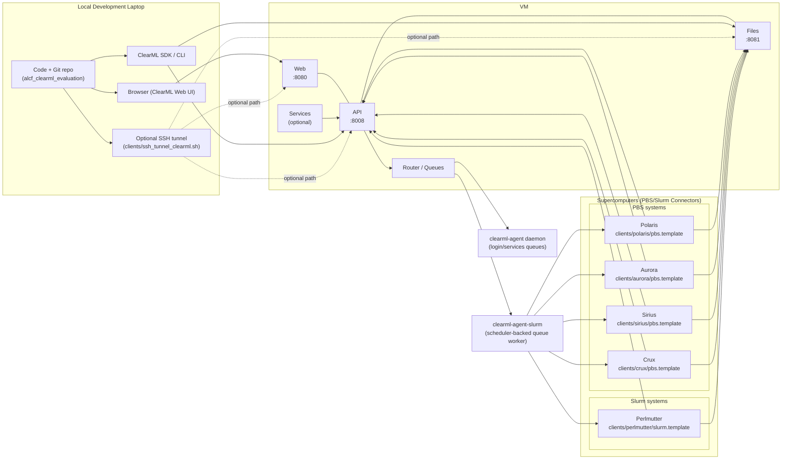

# ClearML + HPC Architecture

```mermaid
flowchart LR
    %% User side
    subgraph LAPTOP["Local Development Laptop"]
      DEV["Code + Git repo\n(alcf_clearml_evaluation)"]
      SDK["ClearML SDK / CLI"]
      BROWSER["Browser (ClearML Web UI)"]
      TUNNEL["Optional SSH tunnel\n(clients/ssh_tunnel_clearml.sh)"]
      DEV --> SDK
      DEV --> BROWSER
      DEV --> TUNNEL
    end

    %% Control plane
    subgraph SERVER["VM"]
      direction TB
      WEB["Web\n:8080"]
      API["API\n:8008"]
      FILES["Files\n:8081"]
      ROUTER["Router / Queues"]
      SERVICES["Services\n(optional)"]
      WEB --- API
      API --- FILES
      API --> ROUTER
      SERVICES --> API
    end

    BROWSER --> WEB
    SDK --> API
    SDK --> FILES
    TUNNEL -. optional path .-> WEB
    TUNNEL -. optional path .-> API
    TUNNEL -. optional path .-> FILES

    %% HPC systems
    subgraph HPC["Supercomputers (PBS/Slurm Connectors)"]
      subgraph PBS_SYS["PBS systems"]
        POL["Polaris\nclients/polaris/pbs.template"]
        AUR["Aurora\nclients/aurora/pbs.template"]
        SIR["Sirius\nclients/sirius/pbs.template"]
        CRX["Crux\nclients/crux/pbs.template"]
      end
      subgraph SLURM_SYS["Slurm systems"]
        PER["Perlmutter\nclients/perlmutter/slurm.template"]
      end
    end

    ROUTER --> AGP["clearml-agent daemon\n(login/services queues)"]
    ROUTER --> AGS["clearml-agent-slurm\n(scheduler-backed queue worker)"]

    AGS --> POL
    AGS --> AUR
    AGS --> SIR
    AGS --> CRX
    AGS --> PER

    POL --> FILES
    AUR --> FILES
    SIR --> FILES
    CRX --> FILES
    PER --> FILES

    POL --> API
    AUR --> API
    SIR --> API
    CRX --> API
    PER --> API
```
