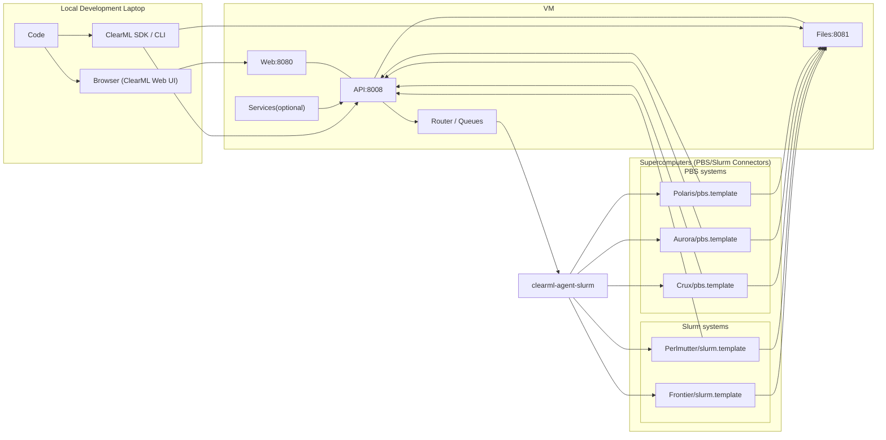

# ClearML + HPC Architecture

```mermaid
flowchart LR
    %% User side
    subgraph LAPTOP["Local Development Laptop"]
      DEV["Code"]
      SDK["ClearML SDK / CLI"]
      BROWSER["Browser (ClearML Web UI)"]
      DEV --> SDK
      DEV --> BROWSER
    end

    %% Control plane
    subgraph SERVER["VM"]
      direction TB
      WEB["Web:8080"]
      API["API:8008"]
      FILES["Files:8081"]
      ROUTER["Router / Queues"]
      SERVICES["Services(optional)"]
      WEB --- API
      API --- FILES
      API --> ROUTER
      SERVICES --> API
    end

    BROWSER --> WEB
    SDK --> API
    SDK --> FILES

    %% HPC systems
    subgraph HPC["Supercomputers (PBS/Slurm Connectors)"]
      subgraph PBS_SYS["PBS systems"]
        POL["Polaris/pbs.template"]
        AUR["Aurora/pbs.template"]
        CRX["Crux/pbs.template"]
      end
      subgraph SLURM_SYS["Slurm systems"]
        PER["Perlmutter/slurm.template"]
        FRO["Frontier/slurm.template"]
      end
    end

    ROUTER --> AGS["clearml-agent-slurm"]

    AGS --> POL
    AGS --> AUR
    AGS --> CRX
    AGS --> PER
    AGS --> FRO

    POL --> FILES
    AUR --> FILES
    CRX --> FILES
    PER --> FILES
    FRO --> FILES

    POL --> API
    AUR --> API
    CRX --> API
    PER --> API
```

