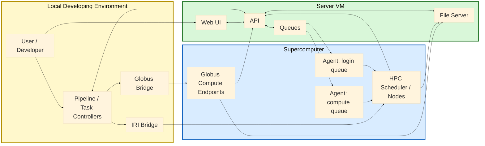

# ClearML Evaluation on ALCF systems

Author: Huihuo Zheng

This repository contains setup scripts and example workflows for evaluating ClearML (server + agents) on ALCF systems. It includes server setup notes/scripts, client/agent scripts and templates for different ALCF systems, and runnable examples for job launching, pipelines, experiment tracking, and datasets.

## Quick links
- [Server setup guide](server/README.md)
- [Globus bridge package guide](clearml_bridges/clearml_globus_bridge/README.md)
- [Pipeline examples guide](examples/pipeline/README.md)
- [Globus endpoint notes](clients/globus_endpoint_setup/README.md)

## Repository layout
- [README.md](README.md): Top-level navigation and setup flow.
- `server/`: ClearML server setup and Globus auth connector.
- `clients/`: Client-side setup split into agent setup and endpoint setup helpers.
- `examples/`: Runnable examples for job launching, pipelines, data, and tracking.
- `clearml_bridges/clearml_globus_bridge/`: Globus bridge package and endpoint config tools.
- `clearml_bridges/clearml_iri_bridge/`: IRI bridge package and submit wrapper.
- `clients/globus_endpoint_setup/`: Endpoint configuration references.
- `pyproject.toml`, `requirements.txt`: Package/dependency definitions.

Directory snapshot:
```text
.
├── clients/
│   ├── README.md
│   ├── clearml_agent_setup/
│   │   ├── install_clearml.sh
│   │   ├── launch_clearml_agent.sh
│   │   ├── launch_local_agent.sh
│   │   ├── aurora|crux|perlmutter|polaris|sirius/
│   │   └── README.md
│   └── globus_endpoint_setup/
│       ├── ssh_proxy.sh
│       ├── ssh_tunnel_clearml.sh
│       └── README.md
├── clearml_bridges/clearml_globus_bridge/
│   ├── README.md
│   ├── configure_pbs_endpoint.py
│   ├── configure_slurm_endpoint.py
│   ├── globus_compute_launcher.py
│   └── submit_globus_job.py
├── clearml_bridges/clearml_iri_bridge/
│   ├── iri_launcher.py
│   └── submit_iri_job.py
├── examples/
│   ├── data_catalog/
│   ├── data_movement/
│   ├── experiment_tracking/
│   ├── job_launching/
│   └── pipeline/
├── server/
│   ├── README.md
│   ├── ubuntu_setup.sh
│   └── globus_auth/
└── README.md
```

## Setup from scratch

For a full fresh setup, use this order.

### ClearML System Schematic



This architecture uses ClearML as the control plane and your compute systems as the execution plane. The ClearML server provides the API, Web UI, and fileserver. Users interact with the UI or run pipeline/task controllers from code, and those controllers create tasks, enqueue work, and track state through the ClearML API.

Agents are attached to specific queues (for example login vs compute queues). When tasks are enqueued, the matching agent pulls the task and launches it on the target environment (login node, scheduler submission, or direct compute execution, depending on your agent mode and queue policy). This queue-based model lets one workflow dispatch different steps to different facilities without changing application logic.

For remote execution patterns, bridge components extend ClearML without replacing it. The Globus bridge submits work to Globus Compute endpoints, and the IRI bridge submits work to an IRI-compatible facility API. In both cases, ClearML remains the orchestration system of record: task lifecycle, logs, metrics, and artifacts are reported back to ClearML so runs remain traceable in one place.

End-to-end flow is: define/run pipeline or task -> enqueue to ClearML queue -> execute on agent or bridge backend -> collect outputs -> upload artifacts/metrics to ClearML fileserver/API -> monitor status and results in the ClearML UI. This keeps scheduling/execution flexible while preserving a consistent experiment and operations interface.

1. **Server setup**
- Follow [server/README.md](server/README.md).
- Run `server/ubuntu_setup.sh` on the server VM.

2. **Client setup**
- Install/configure ClearML agents from `clients/`.
- Run:
  ```bash
  bash clients/clearml_agent_setup/install_clearml.sh
  bash clients/clearml_agent_setup/launch_clearml_agent.sh
  ```

3. **Globus bridge installation**
- Install this repository as a package:
  ```bash
  pip install -e .
  ```
- This enables bridge tooling such as:
  - `clearml-globus-submit`
  - `clearml-globus-configure-pbs-endpoint`
  - `clearml-globus-configure-slurm-endpoint`
  - `clearml-globus-token`
  - `clearml-globus-endpoints`
  - `clearml-globus-transfer`
  - `clearml-globus-transfer-launch`
- Usage docs:
  - [clearml_bridges/clearml_globus_bridge/README.md](clearml_bridges/clearml_globus_bridge/README.md)
  - [examples/pipeline/globus_compute_bridge/README.md](examples/pipeline/globus_compute_bridge/README.md)

## Setup scripts

### ClearML server (VM)
Files: [server/README.md](server/README.md), `server/ubuntu_setup.sh`.
Typical flow (from [server/README.md](server/README.md)): provision a VM and open ports 8080/8081/8001, copy ClearML-provided `docker-compose.yml`, `docker-compose.override.yml`, and `constants.env` into `/opt/allegro/`, run `server/ubuntu_setup.sh`, then recompose via `docker-compose`.

### ClearML agent (client)
Files: `clients/clearml_agent_setup/install_clearml.sh`, `clients/clearml_agent_setup/launch_clearml_agent.sh`, `clients/clearml_agent_setup/*/pbs.template`, `clients/clearml_agent_setup/*/clearml.conf`.
Use `clients/clearml_agent_setup/install_clearml.sh` to install `clearml-agent-slurm` and `clearml-agent`, then `clients/clearml_agent_setup/launch_clearml_agent.sh` to start agents using scheduler templates and a target queue.

### Test environment setup
File: `examples/setup.sh`. This exports environment variables commonly used on ALCF systems (proxy, OpenBLAS, ClearML agent config).

## Examples
There is no single test runner; run the individual scripts in `examples/` as needed.

### Job launching
* Python enqueue examples: 
    - `examples/job_launching/python/test_login.py`: run tasks on login node through clearml-agent queue
    - `examples/job_launching/python/test_queue.py`: run tasks on compute node(s) through clearml-slurm-agent queue
* Bash/PBS examples: 
    - `examples/job_launching/bash/test_login.py` & `examples/job_launching/bash/run_login.sh`: run tasks on login node with the steps defined in run_login.sh
    - `examples/job_launching/bash/test_queue.py` & `examples/job_launching/bash/run.sh`, run tasks on compute node(s) with the steps defined in run.sh

Example submission: 
```bash
python examples/job_launching/python/test_login.py
```

### Pipelines (examples/)
- `examples/pipeline/pipeline_from_decorator.py` Pipeline built with `PipelineDecorator` components.
- `examples/pipeline/pipeline_from_functions.py` Pipeline built with `PipelineController` function steps.
- `examples/pipeline/pipeline_different_systems.py` Multi-queue pipeline example for different systems.
- `examples/pipeline/hpc_pipeline_demo/` End-to-end HPC pipeline demo with data prep, train, and eval.

### Experiment tracking
- `examples/experiment_tracking/pytorch_mnist.py` ClearML experiment tracking example (MNIST).

### Datasets
- `examples/data_catalog/test_creation.py` Create and upload a dataset to ClearML.
- `examples/data_catalog/test_upload_link.py` Add external files to a dataset via file links.
- `examples/data_catalog/dolma.py` Register Dolma dataset files as external links.

## Notes
- Many scripts assume ClearML server URLs, queues, and filesystem paths that are specific to ALCF environments. Adjust as needed for your site.

## Globus Compute PBS Config Helper

Use this helper to generate/update endpoint files for PBS-based Globus Compute endpoints:

```bash
clearml-globus-configure-pbs-endpoint \
  --endpoint-name aurora-user \
  --account datascience \
  --queue debug \
  --walltime 00:10:00 \
  --nodes-per-block 1 \
  --cores-per-node 64 \
  --filesystems flare:home \
  --overwrite --backup
```

This writes:
- `~/.globus_compute/<endpoint-name>/config.yaml`
- `~/.globus_compute/<endpoint-name>/user_config_template.yaml.j2`

For Slurm-based endpoints:

```bash
clearml-globus-configure-slurm-endpoint \
  --endpoint-name perlmutter-user \
  --account m1234 \
  --partition regular \
  --qos normal \
  --walltime 00:30:00 \
  --nodes-per-block 1 \
  --cores-per-node 64 \
  --gpus-per-node 4 \
  --overwrite --backup
```

## IRI API Bridge

This repo now also includes an IRI-compatible connector:
- Python module: `clearml_iri_bridge`
- CLI submit wrapper: `clearml-iri-submit`
- Example pipeline: `examples/pipeline/iri_bridge/pipeline.py`

This connector is designed for APIs like `https://api.iri.nersc.gov` and accepts configurable submit/status paths and response field mappings.
