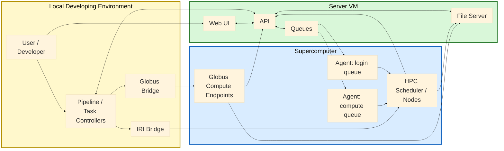

# ClearML Evaluation on ALCF systems

Author: Huihuo Zheng

ClearML is an open-source MLOps platform for experiment tracking, pipeline orchestration, workload scheduling, artifact/dataset management, and remote execution ([official site](https://clear.ml/)). In practice, it provides a central server and agents so teams can run reproducible ML and HPC workflows, monitor progress, and manage results from development through large-scale production runs.

This repository contains how we deploy ClearML in ALCF, with all the setup scripts and example workflows for evaluating ClearML (server + agents) on ALCF systems. At a high level, deployment follows four steps: (1) set up the ClearML server and authentication, (2) configure client environments and start ClearML agents on target systems, (3) connect data/compute bridges such as Globus endpoints, and (4) run validation examples for job launching, pipelines, experiment tracking, and dataset movement.

## Quick links
- [Server setup guide](server/README.md)
 - [AWS deployment guide](docs/aws.md)
- [Client setup guide](clients/README.md)
- [Globus bridge package guide](clearml_bridges/clearml_globus_bridge/README.md)
- [IRI bridge package guide](clearml_bridges/clearml_iri_bridge/README.md)
- [Globus endpoint notes](clients/globus_endpoint_setup/README.md)
- [Examples guide](examples/README.md)
- [Compute guide](docs/compute.md)
- [Transfer guide](docs/transfer.md)
- [Troubleshooting guide](docs/troubleshooting.md)

## Repository layout
- [README.md](README.md): Top-level navigation and setup flow.
- `server/`: ClearML server setup and Globus auth connector.
- `clients/`: Client-side setup split into agent setup and Globus endpoint setup helpers.
    - `clients/globus_endpoint_setup/`: Endpoint configuration references.
    - `clients/clearml_agent_setup/`: ClearML agents (PBS/Slurm) setup 
- `clearml_bridges/` ClearML bridges for HPC job launcher
    - `clearml_bridges/clearml_globus_bridge/`: Globus bridge package and endpoint config tools.
    - `clearml_bridges/clearml_iri_bridge/`: IRI bridge package and submit wrapper.
- `examples/`: Runnable examples for job launching, pipelines, data, and tracking.
- `../aws_clearml_deployment/`: Terraform scaffold and bootstrap files for AWS-based ClearML deployment.
- `pyproject.toml`, `requirements.txt`: Package/dependency definitions.

Directory snapshot:
```text
├── clients/
│   ├── README.md
│   ├── clearml_agent_setup/
│   │   ├── install_clearml.sh
│   │   ├── launch_clearml_agent.sh
│   │   ├── launch_local_agent.sh
│   │   ├── aurora|crux|perlmutter|polaris|sirius/
│   │   └── README.md
│   └── globus_endpoint_setup/
│       ├── ssh_proxy.sh
│       ├── ssh_tunnel_clearml.sh
│       └── README.md
├── clearml_bridges/clearml_globus_bridge/
│   ├── README.md
│   ├── configure_pbs_endpoint.py
│   ├── configure_slurm_endpoint.py
│   ├── globus_compute_launcher.py
│   └── submit_globus_job.py
├── clearml_bridges/clearml_iri_bridge/
│   ├── iri_launcher.py
│   └── submit_iri_job.py
├── examples/
│   ├── README.md
│   ├── data_catalog/
│   ├── data_movement/
│   ├── experiment_tracking/
│   ├── job_launching/
│   └── pipeline/
├── server/
│   ├── README.md
│   ├── ubuntu_setup.sh
│   └── globus_auth/
└── README.md
```

## ClearML setup

The whole system is schematically show in the following architecture plot: 


This architecture uses ClearML as the control plane and your compute systems as the execution plane. The ClearML server provides the ``API``, ``Web UI``, and ``fileserver``. Users interact with the UI or run pipeline/task ``controllers`` from code, and those ``controllers`` create ``tasks``, enqueue work on the queues, and track state through the ClearML API.

``Agents`` are attached to specific ``queues`` (for example login vs compute queues). When tasks are enqueued, the matching agent pulls the task and launches it on the target environment (login node, scheduler submission, or direct compute execution, depending on your agent mode and queue policy). This queue-based model lets one ``workflow`` dispatch different steps to different facilities without changing application logic.

For remote execution patterns, we developed a set of bridge components allowing ClearML to launch jobs via custom channels besides ClearML agents: Globus Compute, or IRI API. The Globus bridge submits work to Globus Compute endpoints, and the IRI bridge submits work to an IRI-compatible facility API. In both cases, ClearML remains the orchestration system of record: task lifecycle, logs, metrics, and artifacts are reported back to ClearML so runs remain traceable in one place.

End-to-end flow is: define/run pipeline or task on a local development platform -> enqueue to ClearML queue -> execute on agent or bridge backend -> collect outputs -> upload artifacts/metrics to ClearML fileserver/API -> monitor status and results in the ClearML UI. This keeps scheduling/execution flexible while preserving a consistent experiment and operations interface.

### Server setup
Server setup includes provisioning a VM, opening ports `8080/8081/8008`, copying ClearML-provided `docker-compose.yml`, `docker-compose.override.yml`, and `constants.env` into `/opt/allegro/`, running `server/ubuntu_setup.sh`, and then recreating services with `docker-compose`.
- Follow [server/README.md](server/README.md).
- Run `server/ubuntu_setup.sh` on the server VM.

For AWS-based deployment, use [docs/aws.md](docs/aws.md) together with the sibling Terraform scaffold under [`../aws_clearml_deployment/README.md`](../aws_clearml_deployment/README.md).

After the setup, one will be able to access the webUI via: https://amscclearml.alcf.anl.gov (or your own VM address)

### Client setup
There are two ways for submitting jobs, (1) ClearML agents; (2) ClearML custom bridges. 
#### ClearML agents
- In the ClearML Web UI, go to **Workers & Queues -> Queues** and create queues mapped to your target resources.
- Usually create three queues per site/system: ``<prefix>-login``, ``<prefix>-services``, and ``<prefix>-compute`` (for example ``crux-login``, ``crux-services``, ``crux-compute``).
- SSH to the login node (uan node) on each supercomputer, and 
    - Install/configure ClearML agents from `clients/`.
    - Run:
      ```bash
      bash clients/clearml_agent_setup/install_clearml.sh
      CLIENTS=crux bash clients/clearml_agent_setup/launch_clearml_agent.sh
      ```

One can replace ``crux`` with another custom prefix. In this case, three queues/agents are launched: ``crux-login``, ``crux-services``, and ``crux-compute``. The purpose of three queues are as follows: 
- ``crux-login``: lightweight tasks that can run directly on the login node (quick checks, task setup, small orchestration steps).
- ``crux-services``: long-running service-style tasks (for example controllers, watchers, or bridge/service processes that should stay available).
- ``crux-compute``: actual compute workloads submitted to scheduler-backed compute nodes (training, batch processing, large experiments).

After this setup, the ClearML agents listen on their assigned queues and pull any tasks enqueued to those queues.

#### Globus bridges

- Install this repository as a package:
  ```bash
  pip install -e .
  ```
- This enables bridge tooling such as:
  - `clearml-globus-configure-pbs-endpoint`: generate or update Globus Compute endpoint configs for PBS-based systems.
  - `clearml-globus-configure-slurm-endpoint`: generate or update Globus Compute endpoint configs for Slurm-based systems.
  - `clearml-globus-endpoints`: list Globus Compute endpoints visible to the current identity/token.
  - `clearml-globus-submit`: submit and optionally poll Globus Compute jobs from ClearML tasks.
  - `clearml-globus-token`: obtain/export Globus access tokens for Compute or Transfer workflows.
  - `clearml-globus-transfer`: execute data movement using Globus Transfer (file or recursive directory copy).
- Usage docs:
  - [clearml_bridges/clearml_globus_bridge/README.md](clearml_bridges/clearml_globus_bridge/README.md)
  - [examples/pipeline/globus_compute_bridge/README.md](examples/pipeline/globus_compute_bridge/README.md)

#### IRI bridge

- Install this repository as a package:
  ```bash
  pip install -e .
  ```
- This enables:
  - `clearml-iri-launch`: create and optionally enqueue an IRI-backed ClearML task.
  - `clearml-iri-submit`: submit to an IRI-compatible API, poll status, and upload the final response as a ClearML artifact.
- Usage docs:
  - [clearml_bridges/clearml_iri_bridge/README.md](clearml_bridges/clearml_iri_bridge/README.md)
  - [examples/pipeline/iri_bridge/README.md](examples/pipeline/iri_bridge/README.md)

## Examples
There is no single test runner; run the individual scripts in `examples/` as needed.

### Job launching
* Python enqueue examples: 
    - `examples/job_launching/python/test_login.py`: run tasks on login node through clearml-agent queue
    - `examples/job_launching/python/test_queue.py`: run tasks on compute node(s) through clearml-slurm-agent queue
* Bash/PBS examples: 
    - `examples/job_launching/bash/test_login.py` & `examples/job_launching/bash/run_login.sh`: run tasks on login node with the steps defined in run_login.sh
    - `examples/job_launching/bash/test_queue.py` & `examples/job_launching/bash/run.sh`, run tasks on compute node(s) with the steps defined in run.sh

### Pipelines (examples/)
- `examples/pipeline/pipeline_from_decorator.py` Pipeline built with `PipelineDecorator` components.
- `examples/pipeline/pipeline_from_functions.py` Pipeline built with `PipelineController` function steps.
- `examples/pipeline/pipeline_different_systems.py` Multi-queue pipeline example for different systems.
- `examples/pipeline/hpc_pipeline_demo/` End-to-end HPC pipeline demo with data prep, train, and eval.

### Experiment tracking
- `examples/experiment_tracking/pytorch_mnist.py` ClearML experiment tracking example (MNIST).

### Datasets
- `examples/data_catalog/test_creation.py` Create and upload a dataset to ClearML.
- `examples/data_catalog/test_upload_link.py` Add external files to a dataset via file links.
- `examples/data_catalog/dolma.py` Register Dolma dataset files as external links.

## Notes
- Many scripts assume ClearML server URLs, queues, and filesystem paths that are specific to ALCF environments. Adjust as needed for your site.
