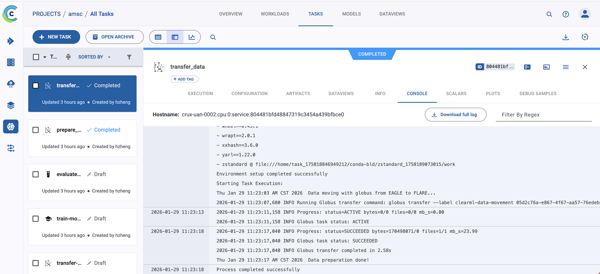

# Data movement examples

This folder contains data movement examples for Globus Transfer and ClearML task orchestration.

## Prereqs
- Globus CLI installed and authenticated (`globus login`)
    ```bash
    pip install globus-cli
    ```
- ClearML configured (optional)

## Globus CLI setup (one-time)
1) Log in and store tokens:
```bash
globus login --consent
```
If you are on a remote node without a browser:
```bash
globus login --no-local-server --consent
```

2) Verify your identity:
```bash
globus whoami
```

3) If a collection requires consent, grant it:
```bash
globus session consent 'urn:globus:auth:scope:transfer.api.globus.org:all[*https://auth.globus.org/scopes/<COLLECTION_ID>/data_access]'
```

## Run
Set source/destination endpoints and paths via arguments (env vars are accepted as defaults). Endpoint names like `alcf#dtn_eagle` will be resolved automatically using `globus endpoint search` on this CLI version:
```bash
clearml-globus-transfer \
  --src-endpoint alcf#dtn_eagle \
  --dst-endpoint alcf#dtn_flare \
  --src-path xxx \
  --dst-path xxx \
  --recursive \
  --poll-interval 10
```

Equivalent example script (creates a transfer task via `GlobusDataMover` and optionally enqueues with `--queue`):
```bash
python examples/data_movement/transfer_globus.py ...
```

### Direct Globus CLI example
```bash
globus transfer --activate \
  05d2c76a-e867-4f67-aa57-76edeb0beda0:/datasets/test.txt \
  f39a7a0f-5bfc-46ce-9615-ba9f8592814f:/datascience/test.txt
```

Optional:
- `GLOBUS_LABEL` custom transfer label
- `GLOBUS_SYNC_LEVEL` (e.g., `mtime`, `checksum`, `exists`)
- `GLOBUS_DRY_RUN=1` to print the command without executing
- `GLOBUS_POLL_INTERVAL` polling interval in seconds for ClearML progress logging
- `--no-wait` to return immediately after submitting the transfer
- `--token` for direct runs only (will be visible in ClearML task params if passed as an arg)
- `--token-env-var` (default `GLOBUS_TRANSFER_ACCESS_TOKEN`) for queue-safe token lookup on the worker

## Enqueue via ClearML
Use `launch_transfer.py` to create and enqueue a ClearML task:
```bash
clearml-globus-transfer-launch \
  --src-endpoint alcf#dtn_eagle \
  --dst-endpoint alcf#dtn_flare \
  --src-path /datasets/test.txt \
  --dst-path /datascience/test.txt \
  --token-env-var GLOBUS_TRANSFER_ACCESS_TOKEN \
  --queue sirius-login
```

Equivalent example script:
```bash
python examples/data_movement/launch_transfer.py ...
```




The diagram shows a typical Globus transfer flow between two ALCF endpoints. Use this test to validate credentials, endpoint access, and transfer performance before integrating data movement into larger workflows.
