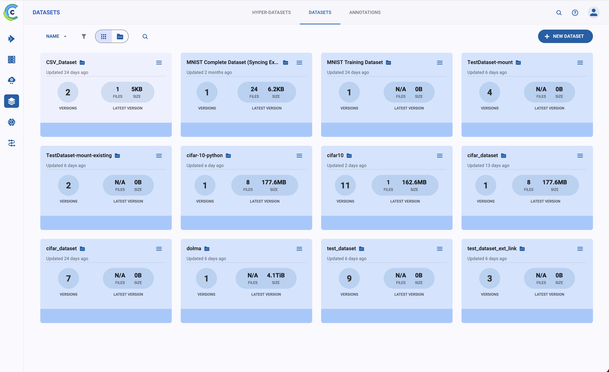
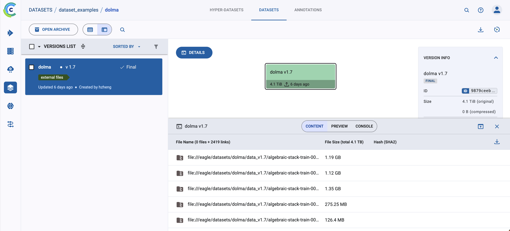

# Dataset creation tests

This folder contains examples for creating, uploading, and downloading ClearML Datasets.

ClearML stores dataset artifacts on the server-side file server configured in your `clearml.conf` (`files_server`). Make sure your client points to the correct fileserver URL so uploads and downloads resolve properly.

- `test_creation.py` Create and upload a small dataset.
- `test_creation_large.py` Create and upload a larger dataset.
- `test_upload_link.py` Register external files via `file://` links without uploading to the files server. 
- `test_download.py` Download a dataset from the ClearML catalog.
- `dolma.py` Register Dolma dataset files as external links.

## Data Catalog

The catalog view lists datasets by project and name, along with metadata such as size, tags, and creation time. Use it to verify uploads and locate dataset IDs for programmatic access.

## Dataset Item

The dataset detail page shows versions and file entries, and provides download actions. It is the primary place to confirm that files were uploaded or linked correctly.
