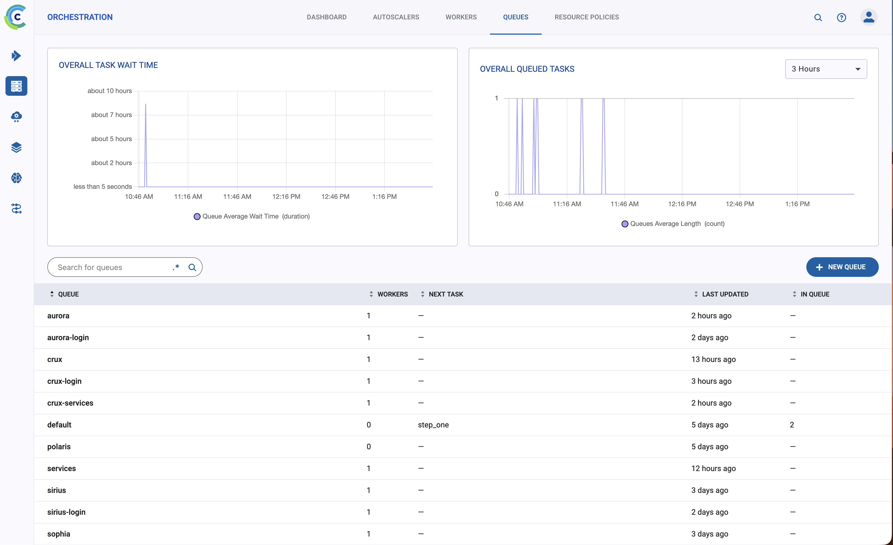
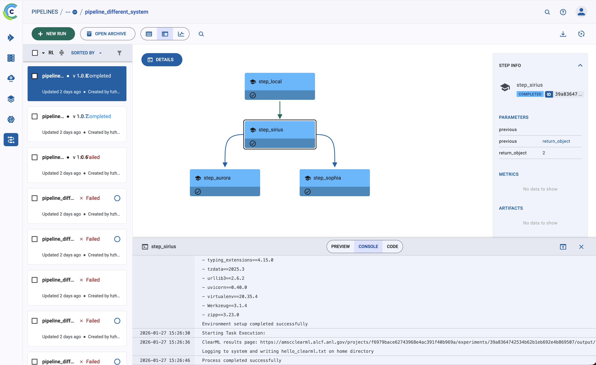
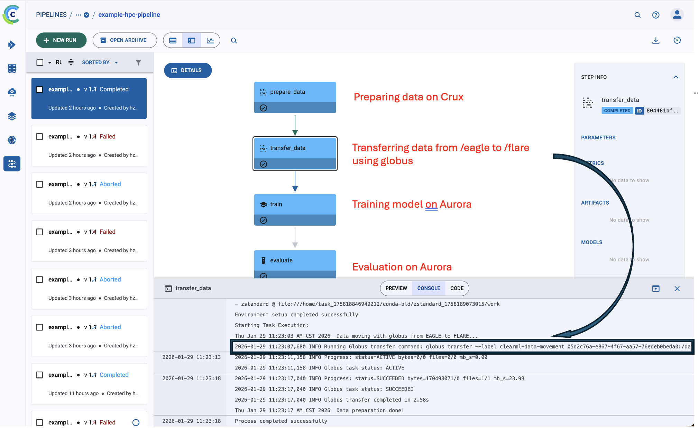

# Pipeline tests

This folder contains ClearML pipeline examples. Pipelines can dispatch steps to different queues, which allows you to run components across multiple supercomputers (one queue per system).

## Run on multiple queues (multiple systems)
To run pipeline steps on multiple queues:

1) Create queues for different systems on the ClearML dashboard
2) Start agents on each system, each listening to its own queue associated to the system
3) Assign `execution_queue` per step.



### Example (PipelineDecorator)
```python
@PipelineDecorator.component(execution_queue="sirius-login")
def step_sirius(...):
    ...

@PipelineDecorator.component(execution_queue="crux-login")
def step_crux(...):
    ...

@PipelineDecorator.component(execution_queue="polaris-login")
def step_polaris(...):
    ...
```



This figure highlights a cross‑system workflow where each pipeline step targets a specific system including local laptop and three other supercomputers (sirius, aurora, sophia), enabling coordination across multiple supercomputers from a single pipeline run.

### Example (PipelineController)
```python
from clearml import Task, PipelineController

# 1) Create base tasks (only once)
prepare_task = Task.create(
    project_name="amsc/pipeline-demo",
    task_name="prepare-data",
    task_type=Task.TaskTypes.data_processing,
    repo="git@github.com:zhenghh04/alcf_clearml_evaluation.git",
    branch="main",
    working_directory="./tests/pipeline/multi_facilities",
    script="./tasks/prepare_data.sh",
    binary="/bin/bash",
)


transfer_task = Task.create(
    project_name="amsc/pipeline-demo",
    task_name="transfer-data",
    task_type=Task.TaskTypes.data_processing,
    repo="git@github.com:zhenghh04/alcf_clearml_evaluation.git",
    branch="main",
    working_directory="./tests/pipeline/multi_facilities",
    script="./tasks/globus_transfer.sh",
    binary="/bin/bash",
)

train_task = Task.create(
    project_name="amsc/pipeline-demo",
    task_name="train-model",
    task_type=Task.TaskTypes.training,
    repo="git@github.com:zhenghh04/alcf_clearml_evaluation.git",
    branch="main",
    working_directory="./tests/pipeline/multi_facilities",
    script="./tasks/train.sh",
    binary="/bin/bash",
)

train_task.set_user_properties(
    walltime="0:20:00",
    num_nodes=1,
    account="datascience",
    queue="debug",
)

eval_task = Task.create(
    project_name="amsc/pipeline-demo",
    task_name="evaluate-model",
    task_type=Task.TaskTypes.testing,
    repo="git@github.com:zhenghh04/alcf_clearml_evaluation.git",
    branch="main",
    working_directory="./tests/pipeline/multi_facilities",
    script="./tasks/evaluate.sh",
    binary="/bin/bash",
)

eval_task.set_user_properties(
    walltime="0:10:00",
    num_nodes=1,
    account="datascience",
    queue = "debug",
)

# 2) Build pipeline using task IDs
pipe = PipelineController(
    name="example-hpc-pipeline",
    project="amsc/pipeline-demo",
    version="1.1",
    packages = ["clearml>=2.1.3"],
    docker = "python:3.13-slim",

)

pipe.add_step(
    name="prepare_data",
    base_task_id=prepare_task.id,
    execution_queue="crux-services",
)

pipe.add_step(
    name="transfer_data",
    base_task_id=transfer_task.id,
    execution_queue="crux-services",
    parents=["prepare_data"],
)

pipe.add_step(
    name="train",
    base_task_id=train_task.id,
    execution_queue="aurora",
    parents=["transfer_data"],
)
pipe.add_step(
    name="evaluate",
    base_task_id=eval_task.id,
    execution_queue="aurora",
    parents=["train"],
)
pipe.start(queue="crux-login")
print("Pipeline started:", pipe.id)

```


The diagram illustrates a multi‑queue pipeline where each stage can be dispatched to a different system. In this example, data preparation and dataset movement run on crux (a CPU system), while training and evaluation can run on compute queues on Aurora.

----

**IMPORTANT**: By default the pipeline controller runs on the `services-agent` queue (on the ClearML server), which you typically do not control. That agent often runs in Docker and may do extra environment setup. To avoid running the controller on `services-agent`, run the controller on a user defined queue:

```python
pipe.start(queue="crux-login")
```

## Notes
- Queues must exist before agents attach. Create a queue by enqueueing a task to it.
- If a step hangs after “Launching step …”, it usually means no agent is listening on that queue.

## Ensemble pipeline with parallel steps (PipelineController)
This example runs two training steps concurrently, then aggregates them in an ensemble evaluation step.

**Files:**
- `tests/pipeline/ensemble_pipeline/pipeline.py`
- `tests/pipeline/ensemble_pipeline/tasks/prepare.sh`
- `tests/pipeline/ensemble_pipeline/tasks/train_a.sh`
- `tests/pipeline/ensemble_pipeline/tasks/train_b.sh`
- `tests/pipeline/ensemble_pipeline/tasks/ensemble_eval.sh`

**Run:**
```bash
python tests/pipeline/ensemble_pipeline/pipeline.py
```

**Key idea (parallel steps):**
```python
pipe.add_step(
    name="train_model_a",
    base_task_id=train_a_task.id,
    execution_queue="aurora",
    parents=["prepare_data"],
)
pipe.add_step(
    name="train_model_b",
    base_task_id=train_b_task.id,
    execution_queue="aurora",
    parents=["prepare_data"],
)
```

Both training steps share the same parent and therefore run concurrently once `prepare_data` finishes. The `ensemble_evaluate` step lists both training steps as parents, so it waits until both are complete.
